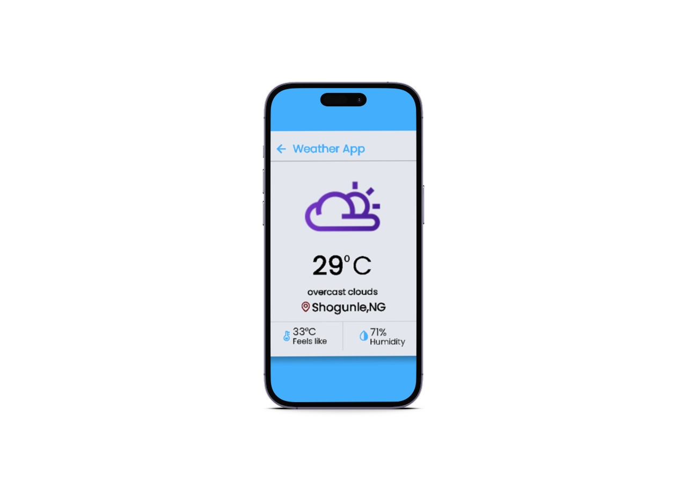

# Weather-App
This is a simple weather app that allows users to search for the current weather conditions in any city around the world. The app uses the OpenWeatherMap API to fetch weather data and displays it in a user-friendly interface.

# Getting Started
To use this app, you will need to have Node.js and npm installed on your computer.

1. Clone this repository: git clone https://github.com/MalikOseni/Weather-App.git
2. Navigate to the project directory: cd Weather-App
3. Install the required dependencies: npm install
4. Obtain an API key from OpenWeatherMap by creating an account and following their API documentation.
5. Create a .env file in the project root directory and add your API key: API_KEY=your_api_key_here
6. Start the development server: npm start
7. Open http://localhost:3000 in your web browser to use the app.

# Usage
To search for the weather conditions in a city, simply enter the city name in the search bar and click the "Search" button. The app will display the current temperature, humidity, wind speed, and weather description for the specified city.

# Contributing
Contributions to this project are welcome. To contribute, please follow these steps:

1. Fork this repository.
2. Create a new branch: git checkout -b my-new-feature
3. Make your changes and commit them: git commit -m "Add some feature"
4. Push to the new branch: git push origin my-new-feature
5. Submit a pull request.

# Acknowledgements
This app was built using Vanilla Js.
Weather data is obtained from the OpenWeatherMap API.
